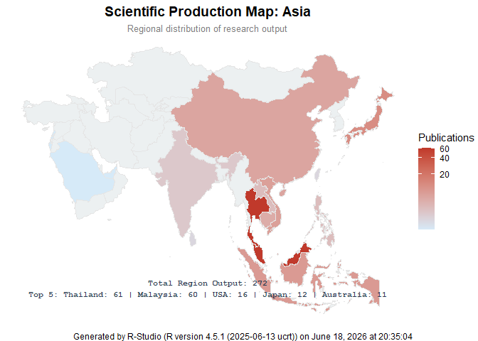
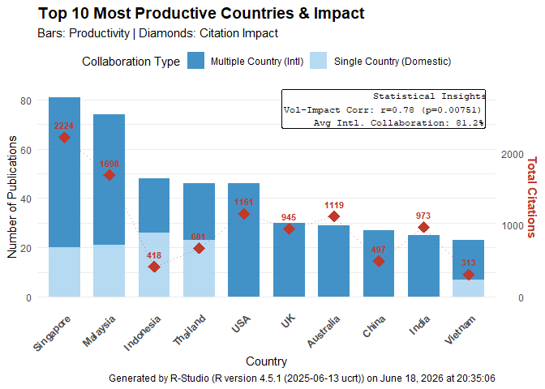
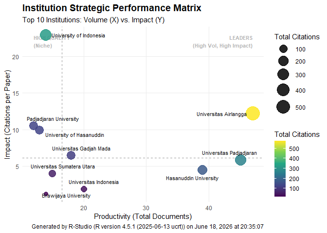
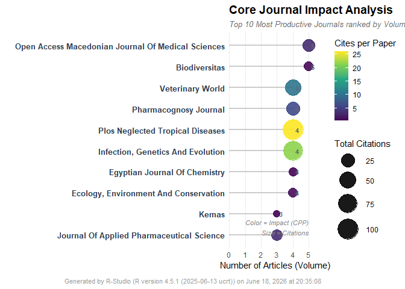
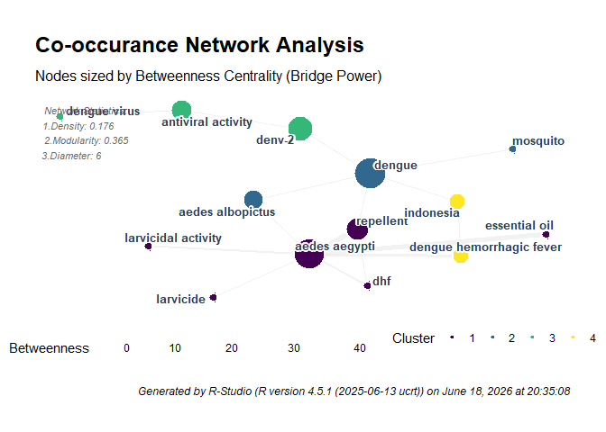
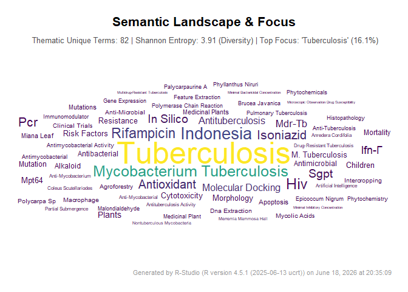
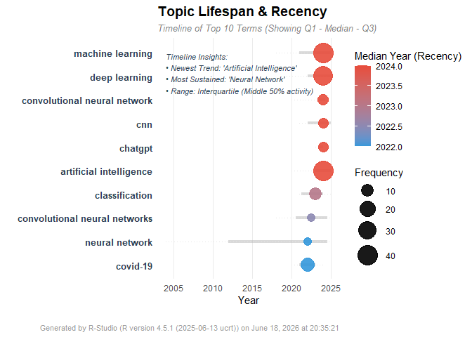

<!-- README.md is generated from README.Rmd. Please edit that file -->

# ARFAN

ARFAN (Analytical R Functions for Article Networks) is a comprehensive,
elegant, and user-friendly R package designed for modern bibliometric
and scientometric analysis.

Bridging the gap between raw citation data (from Scopus, Web of Science,
PubMed, etc.) and publication-ready visualizations, ARFAN provides
researchers with automated tools to map scientific literature, discover
research gaps, and visualize academic networks.

✨ Key Features (In Development): 1. Executive Dashboards: Generate
“One-Page” infographic summaries of your entire dataset. 2. Trend
Analysis: Track publication growth, citations, and topic evolution over
time. 3. Regional Analysis: Map global collaborations and
country-specific research output. 4. Network Mapping: Visualize
co-authorship, bibliographic coupling, and citation hubs. 5. Text
Mining: Generate beautiful word clouds and keyword co-occurrence
networks.

## Authors / Contributors

- **Muhammad Almanfaluthi** - *Creator & Lead Developer* -
  [Almanfaluthi](https://github.com/Almanfaluthi) - Department of
  Tropical Medicine and Parasitology, Faculty of Medicine, Universitas
  Muhammadiyah Purwokerto, Central Java, Indonesia
- **Khusnul Fathoni Effendy** - *Methodology & Co-Author* - Faculty of
  Medicine, Brawijaya University, East Java, Indonesia
- **Satini Yuniarsih** - *Methodology & Co-Author* - Muslim Kaffah
  Foundation, East Java, Indonesia
- **Stefani Widodo** - *Methodology & Co-Author* - Department of Public
  Health, Faculty of Medicine, Universitas Muhammadiyah Purwokerto,
  Central Java, Indonesia
- **Zuhrotun Ulya** - *Methodology & Co-Author* - Faculty of Medicine,
  Brawijaya University, East Java, Indonesia
- **Shalahuddin Maulidi** - *Methodology & Co-Author* - Lembaga
  Kesehatan Gigi dan Mulut Pusat Kesehatan TNI Angkatan Darat
  (Indonesian Army)
- **Rara Tarika** - *Methodology & Co-Author* - Lembaga Kesehatan Gigi
  dan Mulut Pusat Kesehatan TNI Angkatan Darat (Indonesian Army)
- **Abidah Safitri** - *Methodology & Co-Author* - Muslim Kaffah
  Foundation, East Java, Indonesia

## Installation

You can install the development version of ARFAN like so:
“devtools::install_github(”Almanfaluthi/ARFAN”)”

## Example

This is a basic example which shows you how to solve a common problem:

``` r
library(ARFAN)
# Almanfaluthi et all (Evolution of Artificial Intelligence in Patient Safety Across South East Asia)
# https://doi.org/10.53806/iamsph.v7i1.1447
alman_bib_A0_ExecutiveSummary(df_patientsafety) 
```


``` r

# Arista Elda Monica et all (Herbal Medicine field in Tropical Disease Filariasis)
# https://doi.org/10.1051/bioconf/202515403002
alman_bib_A0_ExecutiveSummaryIndo(df_herbal_filaria, primary_col = "#2c3e50", accent_col = "#e74c3c")
```


``` r

# Ade Dian Shah Putri et all (Herbal Medicine field in Tropical Disease Leptospirosis)
# https://doi.org/10.1051/bioconf/202515404001
alman_bib_A1_TrendAnalysis(df_herbal_leptospirosis)
#> `geom_smooth()` using formula = 'y ~ x'
```


``` r

# Ilham Jaluludin et all (Herbal Medicine field in Tropical Disease Snake bite)
# https://doi.org/10.1051/bioconf/202515403005
alman_bib_A2a_AuthorsAnalysis(df_herbal_snakebite)
```


``` r

# Ilham Jaluludin et all (Herbal Medicine field in Tropical Disease Snake bite)
# https://doi.org/10.1051/bioconf/202515403005
alman_bib_A3a_GlobalHeatmap(df_herbal_snakebite)
```


``` r

# Ade Dian Shah Putri et all (Herbal Medicine field in Tropical Disease Leptospirosis)
# https://doi.org/10.1051/bioconf/202515404001
alman_bib_A3b_RegionalHeatmap(df_herbal_leptospirosis)
```



``` r

# Almanfaluthi et all (Evolution of Artificial Intelligence in Patient Safety Across South East Asia)
# https://doi.org/10.53806/iamsph.v7i1.1447
alman_bib_A4a_ProductivityCountry(df_patientsafety)
#> Using citation column: Cited.by
```



``` r

# Annisa Nur Azizah et all (Herbal Medicine field in Tropical Disease Tuberculosis)
# https://doi.org/10.1051/bioconf/202515403001
alman_bib_A4b_ProductivityInstitution(df_herbal_tb)
```



``` r

# Berlianda Nur Sabilla et all (Herbal Medicine field in Tropical Disease Dengue)
# https://doi.org/10.1051/bioconf/202515403003
alman_bib_A4c_ProductivityJournal(df_herbal_dengue)
```



``` r

# Berlianda Nur Sabilla et all (Herbal Medicine field in Tropical Disease Dengue)
# https://doi.org/10.1051/bioconf/202515403003
alman_bib_A5a_Keyword_Occurance(df_herbal_dengue)
#> $plot
```



    #> 
    #> $global_stats
    #>                    Metric Value
    #> 1         Network Density 0.176
    #> 2 Modularity (Clustering) 0.365
    #> 3        Network Diameter 6.000
    #> 4         Avg Path Length 2.640
    #> 
    #> $top_nodes
    #> # A tibble: 10 × 4
    #>    name                     Community Betweenness Degree
    #>    <chr>                    <fct>           <dbl>  <dbl>
    #>  1 dengue                   2                42        5
    #>  2 aedes aegypti            1                38        7
    #>  3 denv-2                   3                22        2
    #>  4 repellent                1                15.5      3
    #>  5 antiviral activity       3                12        2
    #>  6 aedes albopictus         2                10        2
    #>  7 indonesia                4                 5        2
    #>  8 dengue hemorrhagic fever 4                 4.5      2
    #>  9 dhf                      1                 0        2
    #> 10 essential oil            1                 0        1

    # Annisa Nur Azizah et all (Herbal Medicine field in Tropical Disease Tuberculosis)
    # https://doi.org/10.1051/bioconf/202515403001
    alman_bib_A5b_Keyword_Cloud(df_herbal_tb)



``` r

# Almanfaluthi et all (Evolution of Artificial Intelligence in Patient Safety Across South East Asia)
# https://doi.org/10.53806/iamsph.v7i1.1447
alman_bib_A5c_Keyword_Trend(df_patientsafety)
```


