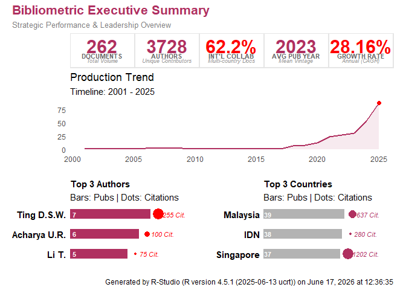
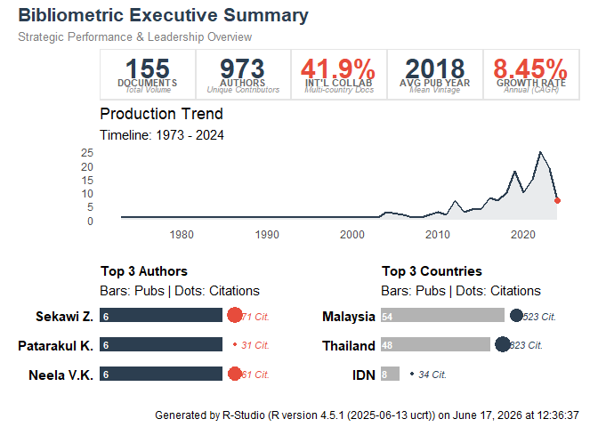
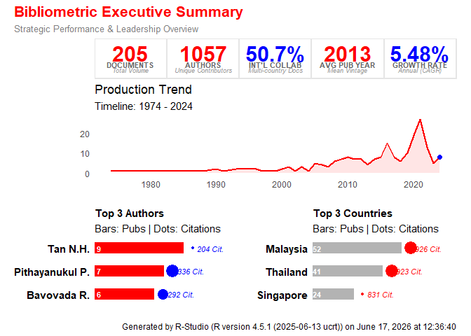
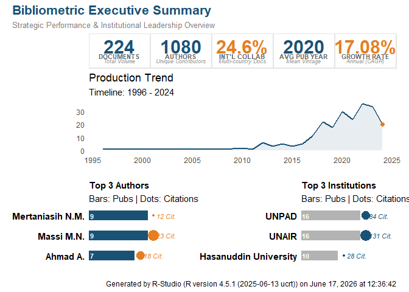
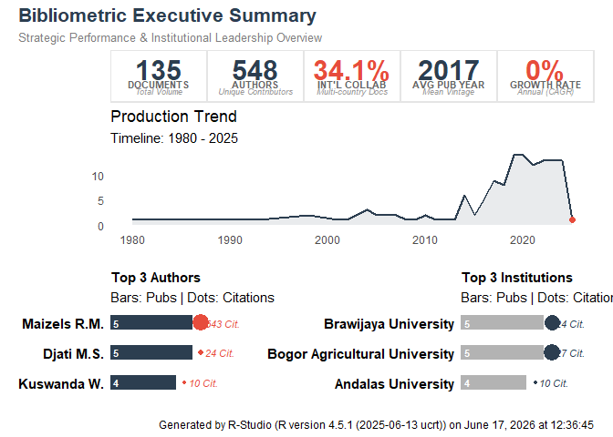

<!-- README.md is generated from README.Rmd. Please edit that file -->

# ARFAN

ARFAN (Analytical R Functions for Article Networks) is a comprehensive,
elegant, and user-friendly R package designed for modern bibliometric
and scientometric analysis.

Bridging the gap between raw citation data (from Scopus, Web of Science,
PubMed, etc.) and publication-ready visualizations, ARFAN provides
researchers with automated tools to map scientific literature, discover
research gaps, and visualize academic networks.

✨ Key Features (In Development): 1. Executive Dashboards: Generate
“One-Page” infographic summaries of your entire dataset. 2. Trend
Analysis: Track publication growth, citations, and topic evolution over
time. 3. Regional Analysis: Map global collaborations and
country-specific research output. 4. Network Mapping: Visualize
co-authorship, bibliographic coupling, and citation hubs. 5. Text
Mining: Generate beautiful word clouds and keyword co-occurrence
networks.

## Installation

You can install the development version of ARFAN like so:
“devtools::install_github(”Almanfaluthi/ARFAN”)”

## Example

This is a basic example which shows you how to solve a common problem:

``` r
library(ARFAN)
alman_bib_A0_ExecutiveSummary(df_patientsafety, year_col = "Year", author_col = "Authors", cite_col = "Cited by", affil_col = "Affiliations")
```



``` r
alman_bib_A0_ExecutiveSummary(df_herbal_leptospirosis, primary_col = "#2c3e50", accent_col = "#e74c3c", exclude_terms = c("United States"))
```



``` r
alman_bib_A0_ExecutiveSummary(df_herbal_snakebite, primary_col = "red", accent_col = "blue", exclude_terms = c("United States"))
```



``` r
alman_bib_A0_ExecutiveSummaryIndo(df_herbal_tb, primary_col = "#1a5276", accent_col = "#e67e22")
```



``` r
alman_bib_A0_ExecutiveSummaryIndo(df_herbal_filaria, primary_col = "#2c3e50", accent_col = "#e74c3c")
```


